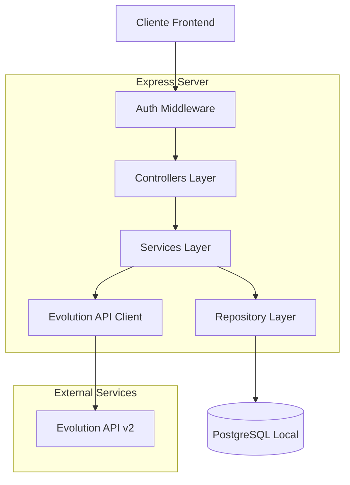
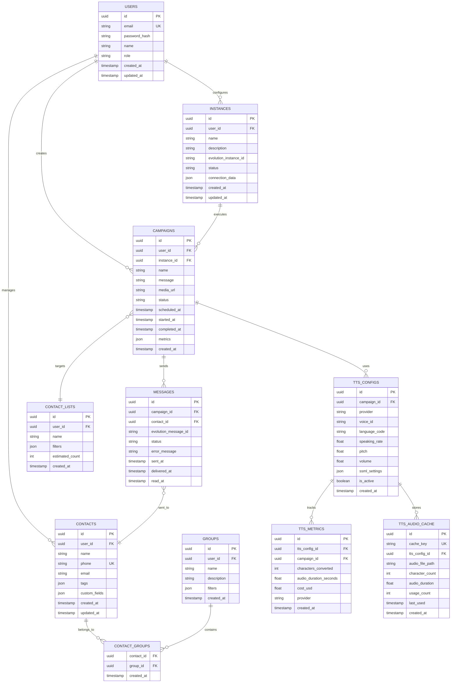

## 1. Arquitetura do Sistema

### 4.6 Configurações TTS

```
POST /api/tts/config
```

Request:

| Parâmetro      | Tipo   | Obrigatório | Descrição                            |
| -------------- | ------ | ----------- | ------------------------------------ |
| campaign\_id   | string | true        | ID da campanha                       |
| provider       | string | true        | Provedor TTS (google/amazon/azure)   |
| voice\_id      | string | true        | ID da voz (ex: pt-BR-Wavenet-A)      |
| language\_code | string | true        | Código do idioma (ex: pt-BR)         |
| speaking\_rate | number | false       | Velocidade (0.25-4.0, default: 1.0)  |
| pitch          | number | false       | Tom (-20.0 a +20.0, default: 0.0)    |
| volume         | number | false       | Volume (-96.0 a +16.0, default: 0.0) |

Response:

```json
{
  "id": "uuid",
  "provider": "google",
  "voice_id": "pt-BR-Wavenet-A",
  "language_code": "pt-BR",
  "speaking_rate": 1.0,
  "pitch": 0.0,
  "volume": 0.0,
  "is_active": true
}
```

```
POST /api/tts/generate
```

Request:

| Parâmetro  | Tipo   | Obrigatório | Descrição                     |
| ---------- | ------ | ----------- | ----------------------------- |
| text       | string | true        | Texto para converter em áudio |
| config\_id | string | true        | ID da configuração TTS        |

Response:

```json
{
  "audio_url": "/api/tts/audio/uuid.mp3",
  "duration": 15.5,
  "character_count": 250,
  "cached": false
}
```

```
GET /api/tts/metrics/:campaign_id
```

Response:

````json
{
  "campaign_id": "uuid",
  "total_characters": 50000,
  "total_audio_duration": 3200.5,
  "total_cost_usd": 0.20,
  "cache_hit_rate": 0.75,
  "provider_breakdown": {
    "google": { "characters": 30000, "cost": 0.12 },
    "amazon": { "characters": 20000, "cost": 0.08 }
  }
}
```mermaid
graph TD
    A[Cliente/Navegador] --> B[Aplicação React]
    B --> C[Express API]
    C --> D[(PostgreSQL Local)]
    C --> E[Evolution API v2]
    C --> F[Redis Cache]
    C --> G[TTS Services]
    
    G --> H[Google Cloud TTS]
    G --> I[Amazon Polly]
    G --> J[Azure TTS]
    
    subgraph "Frontend Layer"
        B
    end
    
    subgraph "Backend Layer"
        C
        F
    end
    
    subgraph "Data Layer"
        D
    end
    
    subgraph "External Services"
        E
        H
        I
        J
    end
    
    E --> G[WhatsApp Web]
    G --> H[Dispositivos WhatsApp]
````

## 2. Descrição das Tecnologias

* **Frontend**: React\@18 + TypeScript + Vite + Tailwind CSS

* **Backend**: Express\@4 + TypeScript + Node.js\@18

* **Database**: PostgreSQL\@15 com conexão local

* **Cache**: Redis para sessões e filas de processamento

* **API Integration**: Evolution API v2 para WhatsApp

* **TTS Integration**: Google Cloud TTS, Amazon Polly, Azure TTS

* **File Storage**: Sistema de arquivos local para mídias e áudios TTS

* **Authentication**: JWT com bcrypt para hash de senhas

* **ORM**: pg ou node-postgres para queries SQL

## 2.1 Configuração do PostgreSQL Local

### Instalação

```bash
# Windows (usando Chocolatey)
choco install postgresql

# macOS (usando Homebrew)
brew install postgresql@15

# Ubuntu/Debian
sudo apt-get install postgresql postgresql-contrib
```

### Configuração Inicial

```bash
# Iniciar serviço PostgreSQL
sudo systemctl start postgresql

# Criar usuário e banco de dados
sudo -u postgres createuser -P crm_whatsapp_user
sudo -u postgres createdb -O crm_whatsapp_user crm_whatsapp_db

# Acessar console PostgreSQL
sudo -u postgres psql
```

### Variáveis de Ambiente

```bash
# .env file
DB_HOST=localhost
DB_PORT=5432
DB_NAME=crm_whatsapp_db
DB_USER=crm_whatsapp_user
DB_PASSWORD=sua_senha_segura
DB_SSL=false
DB_POOL_SIZE=20
```

## 3. Definições de Rotas

| Rota              | Propósito                               |
| ----------------- | --------------------------------------- |
| /                 | Dashboard principal com métricas        |
| /login            | Página de autenticação do usuário       |
| /contacts         | Gerenciamento de contatos e importação  |
| /campaigns        | Criação e gerenciamento de campanhas    |
| /campaigns/new    | Formulário de nova campanha             |
| /campaigns/:id    | Detalhes e métricas da campanha         |
| /instances        | Gerenciamento de instâncias WhatsApp    |
| /instances/:id/qr | Exibição do QR Code para conexão        |
| /metrics          | Relatórios e análises detalhadas        |
| /settings         | Configurações do sistema e integrações  |
| /api/\*           | Rotas da API REST (documentadas abaixo) |

## 4. Definições de API

### 4.1 Autenticação

```
POST /api/auth/login
```

Request:

| Parâmetro | Tipo   | Obrigatório | Descrição        |
| --------- | ------ | ----------- | ---------------- |
| email     | string | true        | Email do usuário |
| password  | string | true        | Senha do usuário |

Response:

```json
{
  "token": "eyJhbGciOiJIUzI1NiIsInR5cCI6IkpXVCJ9...",
  "user": {
    "id": "uuid",
    "email": "user@example.com",
    "name": "Nome do Usuário",
    "role": "admin"
  }
}
```

### 4.2 Contatos

```
GET /api/contacts
```

Query Parameters:

| Parâmetro | Tipo   | Obrigatório | Descrição                      |
| --------- | ------ | ----------- | ------------------------------ |
| page      | number | false       | Página atual (default: 1)      |
| limit     | number | false       | Itens por página (default: 50) |
| search    | string | false       | Busca por nome ou telefone     |
| group\_id | string | false       | Filtrar por grupo              |

Response:

```json
{
  "data": [
    {
      "id": "uuid",
      "name": "João Silva",
      "phone": "5511999999999",
      "email": "joao@example.com",
      "tags": ["cliente", "vip"],
      "created_at": "2024-01-01T00:00:00Z"
    }
  ],
  "total": 150,
  "page": 1,
  "totalPages": 3
}
```

```
POST /api/contacts/import
```

Request (multipart/form-data):

| Parâmetro | Tipo   | Obrigatório | Descrição                 |
| --------- | ------ | ----------- | ------------------------- |
| file      | File   | true        | Arquivo Excel/CSV         |
| group\_id | string | false       | ID do grupo para importar |

### 4.3 Campanhas

```
POST /api/campaigns
```

Request:

| Parâmetro         | Tipo   | Obrigatório | Descrição                             |
| ----------------- | ------ | ----------- | ------------------------------------- |
| name              | string | true        | Nome da campanha                      |
| message           | string | true        | Mensagem a ser enviada                |
| contact\_list\_id | string | true        | ID da lista de contatos               |
| media\_url        | string | false       | URL da mídia anexada                  |
| scheduled\_at     | string | false       | Data/hora para agendamento (ISO 8601) |
| instance\_id      | string | true        | ID da instância WhatsApp              |

Response:

```json
{
  "id": "uuid",
  "status": "scheduled",
  "estimated_recipients": 150,
  "created_at": "2024-01-01T00:00:00Z"
}
```

### 4.4 Instâncias WhatsApp

```
POST /api/instances
```

Request:

| Parâmetro   | Tipo   | Obrigatório | Descrição              |
| ----------- | ------ | ----------- | ---------------------- |
| name        | string | true        | Nome da instância      |
| description | string | false       | Descrição da instância |

```

GET /api/instances/:id/qr
```

Response:

```json
{
  "qr_code": "data:image/png;base64,iVBORw0KGgoAAAANSUhEUgAA...",
  "status": "waiting_for_scan",
  "expires_at": "2024-01-01T00:05:00Z"
}
```

### 4.5 Métricas

```
GET /api/metrics/campaigns/:id
```

Response:

```json
{
  "campaign_id": "uuid",
  "total_sent": 150,
  "total_delivered": 145,
  "total_read": 120,
  "total_failed": 5,
  "delivery_rate": 96.7,
  "read_rate": 80.0,
  "details": [
    {
      "contact_id": "uuid",
      "status": "delivered",
      "read_at": "2024-01-01T00:01:00Z",
      "error_message": null
    }
  ]
}
```

## 5. Arquitetura do Servidor



### 5.1 Estrutura de Pastas

```
src/
├── server/
│   ├── controllers/     # Controladores REST
│   ├── services/        # Lógica de negócio
│   ├── repositories/    # Acesso a dados (PostgreSQL)
│   ├── middlewares/     # Auth, validação, etc
│   ├── utils/          # Utilitários
│   ├── types/          # Definições TypeScript
│   ├── config/         # Configurações
│   └── database/       # Migrations e seeds
├── client/
│   ├── components/      # Componentes React
│   ├── pages/          # Páginas da aplicação
│   ├── hooks/          # Custom hooks
│   ├── services/       # Cliente API
│   ├── utils/          # Utilitários frontend
│   └── types/          # Tipos compartilhados
└── shared/
    └── types/           # Tipos compartilhados
```

### 5.2 Configuração de Conexão PostgreSQL

```typescript
// src/server/config/database.ts
import { Pool } from 'pg';
import dotenv from 'dotenv';

dotenv.config();

export const pool = new Pool({
  host: process.env.DB_HOST || 'localhost',
  port: parseInt(process.env.DB_PORT || '5432'),
  database: process.env.DB_NAME,
  user: process.env.DB_USER,
  password: process.env.DB_PASSWORD,
  ssl: process.env.DB_SSL === 'true' ? { rejectUnauthorized: false } : false,
  max: parseInt(process.env.DB_POOL_SIZE || '20'),
  idleTimeoutMillis: 30000,
  connectionTimeoutMillis: 2000,
});

// Testar conexão
export async function testConnection() {
  try {
    const client = await pool.connect();
    console.log('✅ PostgreSQL conectado com sucesso');
    client.release();
  } catch (error) {
    console.error('❌ Erro ao conectar PostgreSQL:', error);
    process.exit(1);
  }
}
```

### 5.3 Exemplo de Repository Pattern

```typescript
// src/server/repositories/UserRepository.ts
import { pool } from '../config/database';
import { User } from '../types/User';

export class UserRepository {
  async findByEmail(email: string): Promise<User | null> {
    const query = 'SELECT * FROM users WHERE email = $1';
    const result = await pool.query(query, [email]);
    return result.rows[0] || null;
  }

  async create(userData: Partial<User>): Promise<User> {
    const query = `
      INSERT INTO users (email, password_hash, name, role)
      VALUES ($1, $2, $3, $4)
      RETURNING *
    `;
    const values = [userData.email, userData.password_hash, userData.name, userData.role || 'operator'];
    const result = await pool.query(query, values);
    return result.rows[0];
  }

  async update(id: string, userData: Partial<User>): Promise<User> {
    const fields = Object.keys(userData).map((key, index) => `${key} = $${index + 2}`).join(', ');
    const query = `UPDATE users SET ${fields}, updated_at = NOW() WHERE id = $1 RETURNING *`;
    const values = [id, ...Object.values(userData)];
    const result = await pool.query(query, values);
    return result.rows[0];
  }
}
```

## 6. Modelo de Dados

### 6.1 Diagrama ER



### 6.2 Definições DDL

**Script de Criação Completo do Banco**

```sql
-- Ativar extensões necessárias
CREATE EXTENSION IF NOT EXISTS "uuid-ossp";
CREATE EXTENSION IF NOT EXISTS "pg_trgm";

-- Tabela de Usuários
CREATE TABLE users (
    id UUID PRIMARY KEY DEFAULT uuid_generate_v4(),
    email VARCHAR(255) UNIQUE NOT NULL,
    password_hash VARCHAR(255) NOT NULL,
    name VARCHAR(100) NOT NULL,
    role VARCHAR(20) DEFAULT 'operator' CHECK (role IN ('admin', 'manager', 'operator')),
    created_at TIMESTAMP WITH TIME ZONE DEFAULT NOW(),
    updated_at TIMESTAMP WITH TIME ZONE DEFAULT NOW()
);

CREATE INDEX idx_users_email ON users(email);
CREATE INDEX idx_users_role ON users(role);

-- Tabela de Contatos
CREATE TABLE contacts (
    id UUID PRIMARY KEY DEFAULT uuid_generate_v4(),
    user_id UUID REFERENCES users(id) ON DELETE CASCADE,
    name VARCHAR(100) NOT NULL,
    phone VARCHAR(20) NOT NULL,
    email VARCHAR(255),
    tags JSONB DEFAULT '[]',
    custom_fields JSONB DEFAULT '{}',
    created_at TIMESTAMP WITH TIME ZONE DEFAULT NOW(),
    updated_at TIMESTAMP WITH TIME ZONE DEFAULT NOW(),
    UNIQUE(user_id, phone)
);

CREATE INDEX idx_contacts_user_id ON contacts(user_id);
CREATE INDEX idx_contacts_phone ON contacts(phone);
CREATE INDEX idx_contacts_tags ON contacts USING GIN(tags);
CREATE INDEX idx_contacts_name_trgm ON contacts USING GIN(name gin_trgm_ops);

-- Tabela de Grupos
CREATE TABLE groups (
    id UUID PRIMARY KEY DEFAULT uuid_generate_v4(),
    user_id UUID REFERENCES users(id) ON DELETE CASCADE,
    name VARCHAR(100) NOT NULL,
    description TEXT,
    filters JSONB DEFAULT '{}',
    created_at TIMESTAMP WITH TIME ZONE DEFAULT NOW(),
    updated_at TIMESTAMP WITH TIME ZONE DEFAULT NOW()
);

CREATE INDEX idx_groups_user_id ON groups(user_id);

-- Tabela de Relacionamento Contatos-Grupos
CREATE TABLE contact_groups (
    contact_id UUID REFERENCES contacts(id) ON DELETE CASCADE,
    group_id UUID REFERENCES groups(id) ON DELETE CASCADE,
    created_at TIMESTAMP WITH TIME ZONE DEFAULT NOW(),
    PRIMARY KEY (contact_id, group_id)
);

CREATE INDEX idx_contact_groups_contact ON contact_groups(contact_id);
CREATE INDEX idx_contact_groups_group ON contact_groups(group_id);

-- Tabela de Listas de Contatos
CREATE TABLE contact_lists (
    id UUID PRIMARY KEY DEFAULT uuid_generate_v4(),
    user_id UUID REFERENCES users(id) ON DELETE CASCADE,
    name VARCHAR(100) NOT NULL,
    filters JSONB DEFAULT '{}',
    estimated_count INTEGER DEFAULT 0,
    created_at TIMESTAMP WITH TIME ZONE DEFAULT NOW(),
    updated_at TIMESTAMP WITH TIME ZONE DEFAULT NOW()
);

CREATE INDEX idx_contact_lists_user_id ON contact_lists(user_id);

-- Tabela de Instâncias WhatsApp
CREATE TABLE instances (
    id UUID PRIMARY KEY DEFAULT uuid_generate_v4(),
    user_id UUID REFERENCES users(id) ON DELETE CASCADE,
    name VARCHAR(100) NOT NULL,
    description TEXT,
    evolution_instance_id VARCHAR(100) UNIQUE,
    status VARCHAR(20) DEFAULT 'disconnected' CHECK (status IN ('connected', 'disconnected', 'connecting', 'error')),
    connection_data JSONB DEFAULT '{}',
    qr_code TEXT,
    qr_expires_at TIMESTAMP WITH TIME ZONE,
    last_connection TIMESTAMP WITH TIME ZONE,
    created_at TIMESTAMP WITH TIME ZONE DEFAULT NOW(),
    updated_at TIMESTAMP WITH TIME ZONE DEFAULT NOW()
);

CREATE INDEX idx_instances_user_id ON instances(user_id);
CREATE INDEX idx_instances_status ON instances(status);
CREATE INDEX idx_instances_evolution_id ON instances(evolution_instance_id);

-- Tabela de Campanhas
CREATE TABLE campaigns (
    id UUID PRIMARY KEY DEFAULT uuid_generate_v4(),
    user_id UUID REFERENCES users(id) ON DELETE CASCADE,
    instance_id UUID REFERENCES instances(id),
    contact_list_id UUID REFERENCES contact_lists(id),
    name VARCHAR(200) NOT NULL,
    message TEXT NOT NULL,
    media_url VARCHAR(500),
    media_type VARCHAR(50),
    status VARCHAR(20) DEFAULT 'draft' CHECK (status IN ('draft', 'scheduled', 'sending', 'completed', 'failed', 'paused')),
    scheduled_at TIMESTAMP WITH TIME ZONE,
    started_at TIMESTAMP WITH TIME ZONE,
    completed_at TIMESTAMP WITH TIME ZONE,
    settings JSONB DEFAULT '{"delay": 1000, "batch_size": 50}',
    metrics JSONB DEFAULT '{}',
    created_at TIMESTAMP WITH TIME ZONE DEFAULT NOW(),
    updated_at TIMESTAMP WITH TIME ZONE DEFAULT NOW()
);

CREATE INDEX idx_campaigns_user_id ON campaigns(user_id);
CREATE INDEX idx_campaigns_status ON campaigns(status);
CREATE INDEX idx_campaigns_scheduled ON campaigns(scheduled_at);
CREATE INDEX idx_campaigns_instance ON campaigns(instance_id);

-- Tabela de Mensagens
CREATE TABLE messages (
    id UUID PRIMARY KEY DEFAULT uuid_generate_v4(),
    campaign_id UUID REFERENCES campaigns(id) ON DELETE CASCADE,
    contact_id UUID REFERENCES contacts(id) ON DELETE CASCADE,
    evolution_message_id VARCHAR(100) UNIQUE,
    status VARCHAR(20) DEFAULT 'pending' CHECK (status IN ('pending', 'sent', 'delivered', 'read', 'failed')),
    retry_count INTEGER DEFAULT 0,
    error_message TEXT,
    sent_at TIMESTAMP WITH TIME ZONE,
    delivered_at TIMESTAMP WITH TIME ZONE,
    read_at TIMESTAMP WITH TIME ZONE,
    created_at TIMESTAMP WITH TIME ZONE DEFAULT NOW(),
    updated_at TIMESTAMP WITH TIME ZONE DEFAULT NOW()
);

CREATE INDEX idx_messages_campaign_id ON messages(campaign_id);
CREATE INDEX idx_messages_contact_id ON messages(contact_id);
CREATE INDEX idx_messages_status ON messages(status);
CREATE INDEX idx_messages_evolution_id ON messages(evolution_message_id);

-- Tabela de Templates de Mensagens
CREATE TABLE message_templates (
    id UUID PRIMARY KEY DEFAULT uuid_generate_v4(),
    user_id UUID REFERENCES users(id) ON DELETE CASCADE,
    name VARCHAR(100) NOT NULL,
    content TEXT NOT NULL,
    variables JSONB DEFAULT '[]',
    category VARCHAR(50) DEFAULT 'general',
    is_active BOOLEAN DEFAULT true,
    created_at TIMESTAMP WITH TIME ZONE DEFAULT NOW(),
    updated_at TIMESTAMP WITH TIME ZONE DEFAULT NOW()
);

CREATE INDEX idx_templates_user_id ON message_templates(user_id);
CREATE INDEX idx_templates_category ON message_templates(category);

-- Tabela de Logs de Atividades
CREATE TABLE activity_logs (
    id UUID PRIMARY KEY DEFAULT uuid_generate_v4(),
    user_id UUID REFERENCES users(id) ON DELETE CASCADE,
    action VARCHAR(100) NOT NULL,
    resource_type VARCHAR(50) NOT NULL,
    resource_id UUID,
    details JSONB DEFAULT '{}',
    ip_address INET,
    user_agent TEXT,
    created_at TIMESTAMP WITH TIME ZONE DEFAULT NOW()
);

CREATE INDEX idx_logs_user_id ON activity_logs(user_id);
CREATE INDEX idx_logs_action ON activity_logs(action);
CREATE INDEX idx_logs_created ON activity_logs(created_at);

-- Função para atualizar timestamp
CREATE OR REPLACE FUNCTION update_updated_at_column()
RETURNS TRIGGER AS $$
BEGIN
    NEW.updated_at = NOW();
    RETURN NEW;
END;
$$ language 'plpgsql';

-- Triggers para atualizar updated_at
CREATE TRIGGER update_users_updated_at BEFORE UPDATE ON users
    FOR EACH ROW EXECUTE FUNCTION update_updated_at_column();

CREATE TRIGGER update_contacts_updated_at BEFORE UPDATE ON contacts
    FOR EACH ROW EXECUTE FUNCTION update_updated_at_column();

CREATE TRIGGER update_groups_updated_at BEFORE UPDATE ON groups
    FOR EACH ROW EXECUTE FUNCTION update_updated_at_column();

CREATE TRIGGER update_instances_updated_at BEFORE UPDATE ON instances
    FOR EACH ROW EXECUTE FUNCTION update_updated_at_column();

CREATE TRIGGER update_campaigns_updated_at BEFORE UPDATE ON campaigns
    FOR EACH ROW EXECUTE FUNCTION update_updated_at_column();

CREATE TRIGGER update_messages_updated_at BEFORE UPDATE ON messages
    FOR EACH ROW EXECUTE FUNCTION update_updated_at_column();

CREATE TRIGGER update_templates_updated_at BEFORE UPDATE ON message_templates
    FOR EACH ROW EXECUTE FUNCTION update_updated_at_column();

-- Tabela de Configurações TTS
CREATE TABLE tts_configs (
    id UUID PRIMARY KEY DEFAULT uuid_generate_v4(),
    campaign_id UUID REFERENCES campaigns(id) ON DELETE CASCADE,
    provider VARCHAR(50) NOT NULL DEFAULT 'google' CHECK (provider IN ('google', 'amazon', 'azure')),
    voice_id VARCHAR(100) NOT NULL DEFAULT 'pt-BR-Wavenet-A',
    language_code VARCHAR(10) NOT NULL DEFAULT 'pt-BR',
    speaking_rate FLOAT DEFAULT 1.0 CHECK (speaking_rate >= 0.25 AND speaking_rate <= 4.0),
    pitch FLOAT DEFAULT 0.0 CHECK (pitch >= -20.0 AND pitch <= 20.0),
    volume FLOAT DEFAULT 0.0 CHECK (volume >= -96.0 AND volume <= 16.0),
    ssml_settings JSONB DEFAULT '{}',
    is_active BOOLEAN DEFAULT true,
    created_at TIMESTAMP WITH TIME ZONE DEFAULT NOW(),
    updated_at TIMESTAMP WITH TIME ZONE DEFAULT NOW()
);

CREATE INDEX idx_tts_configs_campaign_id ON tts_configs(campaign_id);
CREATE INDEX idx_tts_configs_provider ON tts_configs(provider);
CREATE INDEX idx_tts_configs_active ON tts_configs(is_active);

-- Tabela de Métricas TTS
CREATE TABLE tts_metrics (
    id UUID PRIMARY KEY DEFAULT uuid_generate_v4(),
    tts_config_id UUID REFERENCES tts_configs(id) ON DELETE CASCADE,
    campaign_id UUID REFERENCES campaigns(id) ON DELETE CASCADE,
    characters_converted INTEGER NOT NULL DEFAULT 0,
    audio_duration_seconds FLOAT DEFAULT 0.0,
    cost_usd FLOAT DEFAULT 0.0,
    provider VARCHAR(50) NOT NULL,
    created_at TIMESTAMP WITH TIME ZONE DEFAULT NOW()
);

CREATE INDEX idx_tts_metrics_config_id ON tts_metrics(tts_config_id);
CREATE INDEX idx_tts_metrics_campaign_id ON tts_metrics(campaign_id);
CREATE INDEX idx_tts_metrics_provider ON tts_metrics(provider);
CREATE INDEX idx_tts_metrics_created ON tts_metrics(created_at);

-- Tabela de Cache de Áudios TTS
CREATE TABLE tts_audio_cache (
    id UUID PRIMARY KEY DEFAULT uuid_generate_v4(),
    cache_key VARCHAR(256) UNIQUE NOT NULL,
    tts_config_id UUID REFERENCES tts_configs(id) ON DELETE CASCADE,
    audio_file_path VARCHAR(500) NOT NULL,
    character_count INTEGER NOT NULL DEFAULT 0,
    audio_duration FLOAT DEFAULT 0.0,
    usage_count INTEGER DEFAULT 0,
    last_used TIMESTAMP WITH TIME ZONE,
    created_at TIMESTAMP WITH TIME ZONE DEFAULT NOW(),
    expires_at TIMESTAMP WITH TIME ZONE DEFAULT NOW() + INTERVAL '30 days'
);

CREATE INDEX idx_tts_cache_key ON tts_audio_cache(cache_key);
CREATE INDEX idx_tts_cache_config_id ON tts_audio_cache(tts_config_id);
CREATE INDEX idx_tts_cache_expires ON tts_audio_cache(expires_at);
CREATE INDEX idx_tts_cache_last_used ON tts_audio_cache(last_used);

-- Trigger para atualizar tts_configs
CREATE TRIGGER update_tts_configs_updated_at BEFORE UPDATE ON tts_configs
    FOR EACH ROW EXECUTE FUNCTION update_updated_at_column();
```

**Script de Dados Iniciais**

```sql
-- Criar usuário admin padrão (senha: admin123)
INSERT INTO users (email, password_hash, name, role) VALUES (
    'admin@crmwhatsapp.com',
    '$2b$12$LQv3c1yqBWVHxkd0LHAkCOYz6TtxMQJqhN8/LewdBPj/RK.PJ/..G', -- admin123
    'Administrador',
    'admin'
);

-- Templates de mensagens padrão
INSERT INTO message_templates (user_id, name, content, category) VALUES 
    ((SELECT id FROM users WHERE email = 'admin@crmwhatsapp.com'), 'Boas Vindas', 'Olá {nome}! Seja bem-vindo ao nosso serviço.', 'greeting'),
    ((SELECT id FROM users WHERE email = 'admin@crmwhatsapp.com'), 'Promoção', 'Olá {nome}! Temos uma promoção especial para você: {mensagem}', 'marketing'),
    ((SELECT id FROM users WHERE email = 'admin@crmwhatsapp.com'), 'Confirmação', 'Olá {nome}! Sua solicitação foi recebida e será processada em breve.', 'confirmation');
```

## 7. Integração com Evolution API v2

### 7.1 Configuração da Conexão

```typescript
// Evolution API Client
class EvolutionAPI {
  private baseURL: string;
  private apiToken: string;
  
  constructor(baseURL: string, apiToken: string) {
    this.baseURL = baseURL;
    this.apiToken = apiToken;
  }
  
  // Criar nova instância
  async createInstance(instanceName: string) {
    return fetch(`${this.baseURL}/instance/create`, {
      method: 'POST',
      headers: {
        'Content-Type': 'application/json',
        'apikey': this.apiToken
      },
      body: JSON.stringify({
        instanceName,
        qrcode: true,
        integration: "WHATSAPP-BAILEYS"
      })
    });
  }
  
  // Obter QR Code
  async getQRCode(instanceName: string) {
    return fetch(`${this.baseURL}/instance/connectionState/${instanceName}`, {
      headers: { 'apikey': this.apiToken }
    });
  }
  
  // Enviar mensagem de texto
  async sendTextMessage(instanceName: string, phone: string, message: string) {
    return fetch(`${this.baseURL}/message/sendText/${instanceName}`, {
      method: 'POST',
      headers: {
        'Content-Type': 'application/json',
        'apikey': this.apiToken
      },
      body: JSON.stringify({
        number: phone,
        text: message
      })
    });
  }
  
  // Enviar mídia
  async sendMediaMessage(instanceName: string, phone: string, mediaUrl: string, caption: string) {
    return fetch(`${this.baseURL}/message/sendMedia/${instanceName}`, {
      method: 'POST',
      headers: {
        'Content-Type': 'application/json',
        'apikey': this.apiToken
      },
      body: JSON.stringify({
        number: phone,
        mediatype: "image", // ou "video", "audio", "document"
        media: mediaUrl,
        caption: caption
      })
    });
  }
}
```

### 7.2 Webhooks e Eventos

```typescript
// Configurar webhook para receber eventos
async function setupWebhook(instanceName: string, webhookUrl: string) {
  return fetch(`${baseURL}/instance/setWebhook/${instanceName}`, {
    method: 'POST',
    headers: {
      'Content-Type': 'application/json',
      'apikey': apiToken
    },
    body: JSON.stringify({
      webhook: {
        url: webhookUrl,
        headers: {
          'Authorization': 'Bearer seu-token-aqui'
        },
        events: [
          'MESSAGES_UPSERT',      // Mensagens recebidas
          'MESSAGES_UPDATE',      // Atualizações de status
          'CONNECTION_UPDATE',    // Mudanças de conexão
          'QRCODE_UPDATED'       // QR Code atualizado
        ]
      }
    })
  });
}

// Processar eventos recebidos
app.post('/webhooks/evolution', async (req, res) => {
  const { event, data } = req.body;
  
  switch(event) {
    case 'MESSAGES_UPDATE':
      // Atualizar status da mensagem no banco
      await updateMessageStatus(data.key.id, data.status);
      break;
      
    case 'CONNECTION_UPDATE':
      // Atualizar status da instância
      await updateInstanceStatus(data.instance, data.state);
      break;
      
    case 'QRCODE_UPDATED':
      // Atualizar QR Code
      await updateQRCode(data.instance, data.qrcode);
      break;
  }
  
  res.status(200).json({ received: true });
});
```

### 7.3 Tratamento de Erros e Retentativas

```typescript
// Sistema de filas com retentativas
class MessageQueue {
  async processCampaign(campaignId: string) {
    const messages = await getPendingMessages(campaignId);
    
    for (const message of messages) {
      try {
        // Tentar enviar mensagem
        const result = await this.sendMessage(message);
        
        if (result.success) {
          await updateMessageStatus(message.id, 'sent', result.messageId);
        } else {
          throw new Error(result.error);
        }
        
      } catch (error) {
        // Registrar tentativa falhada
        await incrementRetryCount(message.id);
        
        // Agendar retentativa se não excedeu limite
        if (message.retry_count < 3) {
          await scheduleRetry(message.id, calculateDelay(message.retry_count));
        } else {
          await updateMessageStatus(message.id, 'failed', error.message);
        }
      }
      
      // Delay entre mensagens para evitar spam
      await delay(1000);
    }
  }
  
  private calculateDelay(retryCount: number): number {
    // Backoff exponencial: 1min, 5min, 15min
    const delays = [60000, 300000, 900000];
    return delays[retryCount] || 900000;
  }
}
```

## 8. Segurança e Performance

### 8.1 Medidas de Segurança

* **Autenticação JWT**: Tokens com expiração de 24h

* **Rate Limiting**: Limite de 100 requisições por minuto por IP

* **Validação de Dados**: Validação rigorosa de entrada de dados

* **Criptografia**: Senhas hasheadas com bcrypt (salt rounds: 12)

* **CORS**: Configurado apenas para origens permitidas

* **Helmet**: Headers de segurança adicionados

* **SQL Injection**: Proteção através de queries parametrizadas

* **Database Security**: Conexão local sem exposição externa

### 8.2 Otimizações de Performance

* **Paginação**: Limite de 50 registros por página

* **Índices de Banco**: Índices otimizados para queries frequentes

* **Cache Redis**: Cache de sessões e dados frequentes

* **Lazy Loading**: Carregamento sob demanda de componentes

* **Connection Pool**: Pool de conexões com banco de dados (mínimo 20 conexões)

* **Batch Processing**: Processamento de mensagens em lotes de 50-100

* **Para 1000 usuários**:

  * Pool de conexões aumentado para 50-100

  * Índices adicionais em messages(campaign\_id, status, created\_at)

  * Particionamento de tabelas de mensagens por mês

  * Cache Redis com 1GB para filas de processamento

  * Cache de áudios TTS com 10-50GB

### 8.3 Escalabilidade

* **Arquitetura Horizontal**: Múltiplas instâncias do backend

* **Load Balancer**: Distribuição de carga entre instâncias

* **Database Sharding**: Particionamento de dados por usuário

* **Message Queue**: Fila de processamento assíncrono

* **CDN**: Assets estáticos servidos via CDN

### 8.4 Configurações para 1000 Usuários

**Requisitos de Hardware**:

| Componente | Especificação Mínima | Recomendado       |
| ---------- | -------------------- | ----------------- |
| CPU        | 8 cores @ 2.4GHz     | 16 cores @ 3.0GHz |
| RAM        | 16GB                 | 32GB              |
| Storage    | 500GB SSD NVMe       | 1TB SSD NVMe      |
| Network    | 1Gbps                | 10Gbps            |
| PostgreSQL | 4GB RAM dedicado     | 8GB RAM dedicado  |
| Redis      | 1GB                  | 2GB               |
| TTS Cache  | 10GB SSD             | 50GB SSD          |

**Configurações de Banco de Dados**:

```sql
-- Aumentar work_mem para queries complexas
ALTER SYSTEM SET work_mem = '256MB';

-- Aumentar shared_buffers
ALTER SYSTEM SET shared_buffers = '2GB';

-- Aumentar effective_cache_size
ALTER SYSTEM SET effective_cache_size = '6GB';

-- Aumentar max_connections
ALTER SYSTEM SET max_connections = 200;

-- Configurar autovacuum para alta frequência de inserts
ALTER SYSTEM SET autovacuum_vacuum_scale_factor = 0.1;
ALTER SYSTEM SET autovacuum_analyze_scale_factor = 0.05;
```

**Pool de Conexões Otimizado**:

```typescript
export const pool = new Pool({
  host: process.env.DB_HOST || 'localhost',
  port: parseInt(process.env.DB_PORT || '5432'),
  database: process.env.DB_NAME,
  user: process.env.DB_USER,
  password: process.env.DB_PASSWORD,
  ssl: process.env.DB_SSL === 'true' ? { rejectUnauthorized: false } : false,
  max: 100, // Aumentado para 1000 usuários
  idleTimeoutMillis: 30000,
  connectionTimeoutMillis: 5000, // Aumentado timeout
  statement_timeout: 30000, // 30 segundos
  query_timeout: 25000, // 25 segundos
});
```

**Sistema de Filas para 1000 Usuários**:

```typescript
// Configuração do sistema de filas para processamento gradual
class CampaignQueue {
  private readonly MAX_CONCURRENT_MESSAGES = 50;
  private readonly MESSAGE_DELAY_MS = 1200; // 1.2 segundos (0.9-1.4s com variação)
  private readonly BATCH_SIZE = 100;
  
  async processCampaign(campaignId: string, totalContacts: number) {
    const batches = Math.ceil(totalContacts / this.BATCH_SIZE);
    const totalTimeMinutes = Math.ceil((totalContacts * this.MESSAGE_DELAY_MS) / 60000);
    
    console.log(`Processando ${totalContacts} contatos em ${batches} lotes`);
    console.log(`Tempo estimado: ${totalTimeMinutes} minutos`);
    
    for (let i = 0; i < batches; i++) {
      const batchStart = i * this.BATCH_SIZE;
      const batchEnd = Math.min(batchStart + this.BATCH_SIZE, totalContacts);
      
      await this.processBatch(campaignId, batchStart, batchEnd);
      
      // Delay entre lotes para evitar sobrecarga
      if (i < batches - 1) {
        await this.delay(30000); // 30 segundos entre lotes
      }
    }
  }
  
  private async processBatch(campaignId: string, start: number, end: number) {
    const messages = await this.getMessagesBatch(campaignId, start, end);
    
    for (let i = 0; i < messages.length; i++) {
      // Processar mensagem com delay
      await this.processMessage(messages[i]);
      
      // Delay entre mensagens para humanização
      if (i < messages.length - 1) {
        const delay = this.MESSAGE_DELAY_MS + Math.random() * 500; // 1.5-2.0 segundos
        await this.delay(delay);
      }
    }
  }
}
```

**Monitoramento de Performance**:

```typescript
// Sistema de monitoramento para 700 usuários
class PerformanceMonitor {
  private metrics = {
    messagesPerMinute: 0,
    deliveryRate: 0,
    errorRate: 0,
    averageProcessingTime: 0,
    queueSize: 0
  };
  
  async recordMessageProcessing(duration: number, success: boolean) {
    // Registrar métricas de processamento
    this.metrics.averageProcessingTime = 
      (this.metrics.averageProcessingTime * 0.9) + (duration * 0.1);
    
    if (!success) {
      this.metrics.errorRate = Math.min(this.metrics.errorRate + 0.01, 1);
    }
    
    // Alertar se performance degradar
    if (this.metrics.averageProcessingTime > 5000) { // 5 segundos
      await this.sendAlert('ALERTA: Tempo de processamento elevado');
    }
    
    if (this.metrics.errorRate > 0.05) { // 5% de erro
      await this.sendAlert('ALERTA: Taxa de erro acima de 5%');
    }
  }
  
  async getSystemHealth() {
    return {
      status: this.getOverallStatus(),
      metrics: this.metrics,
      recommendations: this.getRecommendations(),
      timestamp: new Date().toISOString()
    };
  }
}
```

**Capacidade de Armazenamento Estimada**:

| Recurso            | Tamanho por Registro | Volume Mensal        | Total Mensal     |
| ------------------ | -------------------- | -------------------- | ---------------- |
| Contatos           | 2KB                  | 1.000                | 2MB              |
| Mensagens          | 5KB                  | 60.000               | 300MB            |
| Logs de Atividade  | 1KB                  | 100.000              | 100MB            |
| Arquivos de Mídia  | 500KB (média)        | 300                  | 150MB            |
| Áudios TTS         | 200KB (média)        | 18.000 (30% únicos)  | 3.6GB            |
| Cache TTS          | 200KB (média)        | 42.000 reutilizações | 8.4GB            |
| **Total Estimado** | -                    | -                    | **\~12.4GB/mês** |

**Otimização de Armazenamento TTS**:

* **Cache de 70%**: Reutilização de áudios iguais reduz em 70% os custos

* **Compressão**: Arquivos MP3 comprimidos a 128kbps

* **TTL de 30 dias**: Áudios antigos são removidos automaticamente

* **Armazenamento em nuvem**: Opção para S3/Google Cloud Storage

* **Dedupicação**: Mesmo texto + configuração = mesmo arquivo

**Alertas e Notificações**:

* Taxa de entrega < 95%

* Tempo de processamento > 5 segundos/mensagem

* Erros de conexão > 3% das tentativas

* Fila de processamento > 1000 mensagens pendentes

* Uso de CPU > 80% por mais de 5 minutos

* Uso de memória > 85%

* Espaço em disco < 20%

* Custo TTS > $50/mês

* Cache hit rate < 60%

### 8.5 Integração TTS Exemplo

```typescript
// Cliente TTS para Google Cloud
class GoogleTTSClient {
  private client: TextToSpeechClient;
  
  constructor() {
    this.client = new TextToSpeechClient({
      credentials: JSON.parse(process.env.GOOGLE_TTS_CREDENTIALS)
    });
  }
  
  async synthesizeSpeech(
    text: string, 
    voiceConfig: TTSConfig
  ): Promise<TTSResult> {
    const request = {
      input: { text },
      voice: {
        languageCode: voiceConfig.languageCode,
        name: voiceConfig.voiceId,
        ssmlGender: this.getGenderFromVoiceId(voiceConfig.voiceId)
      },
      audioConfig: {
        audioEncoding: 'MP3',
        speakingRate: voiceConfig.speakingRate,
        pitch: voiceConfig.pitch,
        volumeGainDb: voiceConfig.volume
      }
    };
    
    const [response] = await this.client.synthesizeSpeech(request);
    
    return {
      audioContent: response.audioContent,
      characterCount: text.length,
      duration: this.estimateDuration(text, voiceConfig.speakingRate)
    };
  }
}

// Serviço de Cache TTS
class TTSCacheService {
  async getCachedAudio(cacheKey: string): Promise<string | null> {
    // Verificar Redis primeiro
    const cached = await redis.get(`tts:${cacheKey}`);
    if (cached) return cached;
    
    // Verificar PostgreSQL
    const result = await pool.query(
      'SELECT audio_file_path FROM tts_audio_cache WHERE cache_key = $1',
      [cacheKey]
    );
    
    if (result.rows.length > 0) {
      const filePath = result.rows[0].audio_file_path;
      // Atualizar contador de uso
      await pool.query(
        'UPDATE tts_audio_cache SET usage_count = usage_count + 1, last_used = NOW() WHERE cache_key = $1',
        [cacheKey]
      );
      return filePath;
    }
    
    return null;
  }
  
  async saveAudio(
    cacheKey: string, 
    audioContent: Buffer, 
    config: TTSConfig
  ): Promise<string> {
    const fileName = `${cacheKey}.mp3`;
    const filePath = path.join(process.env.TTS_AUDIO_PATH, fileName);
    
    // Salvar arquivo
    await fs.promises.writeFile(filePath, audioContent);
    
    // Salvar no banco
    await pool.query(
      `INSERT INTO tts_audio_cache 
       (cache_key, tts_config_id, audio_file_path, character_count, audio_duration)
       VALUES ($1, $2, $3, $4, $5)`,
      [cacheKey, config.id, filePath, config.text.length, config.duration]
    );
    
    // Salvar no Redis
    await redis.setex(`tts:${cacheKey}`, 86400 * 30, filePath); // 30 dias
    
    return filePath;
  }
}
```

