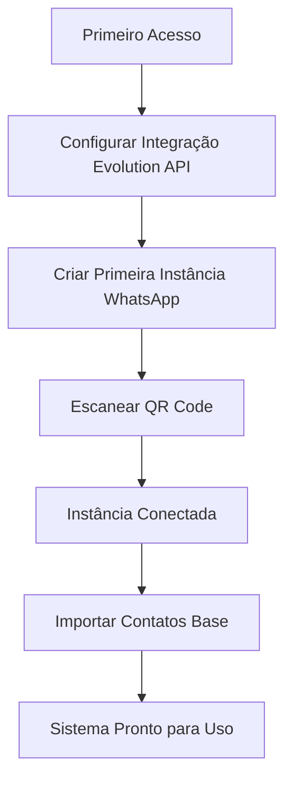
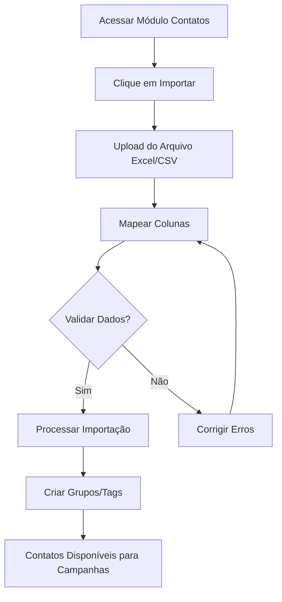

## 1. Visão Geral do Produto

Sistema CRM especializado para envio de notificações e campanhas via WhatsApp utilizando a API Evolution v2. O produto permite que empresas gerenciem contatos, criem segmentações, agendem envios e acompanhem métricas de entrega e recebimento de mensagens em escala.

**Problema resolvido**: Automatização e gerenciamento de comunicação via WhatsApp para empresas que precisam enviar notificações, campanhas de marketing ou mensagens transacionais para seus clientes.

**Público-alvo**: Pequenas e médias empresas, equipes de marketing, atendimento ao cliente e gestores de relacionamento que necessitam de uma ferramenta profissional para comunicação via WhatsApp.

## 2. Funcionalidades Principais

### 2.1 Papéis de Usuário

| Papel | Método de Registro | Permissões Principais |
|------|---------------------|----------------------|
| Administrador | Convite/Cadastro direto | Acesso total: configuração de instâncias, gerenciamento de usuários, todas as funcionalidades |
| Gerente de Campanhas | Cadastro pelo administrador | Criar/editar campanhas, gerenciar contatos, visualizar métricas |
| Operador | Cadastro pelo administrador | Envio de mensagens, visualização de contatos, respostas básicas |

### 2.2 Módulos de Funcionalidades

O sistema CRM de WhatsApp consiste nos seguintes módulos principais:

1. **Dashboard**: Visão geral com métricas, status de instâncias e atividades recentes
2. **Gerenciamento de Contatos**: Importação, cadastro, edição e segmentação de contatos
3. **Campanhas de Mensagens**: Criação, agendamento e envio de campanhas com diferentes tipos de mídia
4. **Instâncias WhatsApp**: Configuração e gerenciamento de múltiplas conexões WhatsApp
5. **Métricas e Relatórios**: Acompanhamento de envios, entregas, leituras e respostas
6. **Configurações**: QR Code, templates de mensagens, integrações e preferências do sistema
7. **Texto-para-Áudio (TTS)**: Conversão de mensagens de texto em áudio com múltiplas vozes e idiomas

### 2.3 Detalhamento das Funcionalidades

| Módulo | Funcionalidade | Descrição |
|---------|----------------|-----------|
| Dashboard | Visão geral de métricas | Exibir total de contatos, campanhas ativas, taxa de entrega e instâncias conectadas |
| Dashboard | Gráficos de desempenho | Apresentar gráficos com envios diários/semanais, taxas de abertura e respostas |
| Dashboard | Atividades recentes | Listar últimas campanhas enviadas, status de entrega e interações recentes |
| Contatos | Importação Excel | Permitir upload de arquivos .xlsx/.csv com mapeamento de colunas para dados de contato |
| Contatos | Cadastro manual | Formulário para adicionar nome, telefone, email, tags e dados personalizados |
| Contatos | Segmentação por grupos | Criar grupos baseados em tags, campos personalizados ou filtros avançados |
| Contatos | Gerenciamento de listas | Criar, editar, excluir e visualizar listas de contatos segmentadas |
| Campanhas | Criar campanha | Definir nome, mensagem, tipo de mídia, lista de contatos e agendamento |
| Campanhas | Editor de mensagens | Editor com suporte a texto, emojis, variáveis personalizadas e templates |
| Campanhas | Anexar mídia | Suporte para upload de imagens, áudio, vídeo e documentos |
| Campanhas | Agendamento | Selecionar data/hora para envio ou envio imediato |
| Campanhas | Preview e teste | Visualizar mensagem antes de enviar e opção de envio de teste |
| Instâncias | Adicionar instância | Configurar nova conexão WhatsApp com nome e descrição |
| Instâncias | QR Code | Gerar e exibir QR Code para conexão com WhatsApp Web |
| Instâncias | Status da conexão | Monitorar status (conectado, desconectado, conectando) |
| Instâncias | Gerenciar múltiplas | Visualizar todas as instâncias com status e métricas individuais |
| Métricas | Relatório de envio | Detalhar mensagens enviadas, entregues, lidas e com erro |
| Métricas | Análise por campanha | Estatísticas específicas de cada campanha com taxas de conversão |
| Métricas | Exportar relatórios | Gerar arquivos Excel/PDF com dados de campanhas e métricas |
| Configurações | Templates de mensagem | Criar e gerenciar templates reutilizáveis para campanhas |
| Configurações | Integração Evolution | Configurar URL base, token de acesso e parâmetros da API |
| Configurações | Sistema de notificações | Alertas por email para status de campanhas e instâncias |
| TTS | Configuração de vozes | Selecionar idioma, gênero, velocidade e tom de voz para conversão |
| TTS | Preview de áudio | Gerar e ouvir preview antes de enviar mensagem de voz |
| TTS | Métricas de uso | Monitorar caracteres convertidos, tempo de áudio e custos |
| TTS | Cache de áudios | Armazenar áudios gerados para reutilização e economia |
| TTS | Fallback para texto | Enviar mensagem de texto quando TTS falhar |

## 3. Fluxos de Operação

### 3.1 Fluxo de Configuração Inicial (Administrador)


### 3.2 Fluxo de Criação e Envio de Campanha
```mermaid
graph TD
    A[Criar Nova Campanha] --> B[Selecionar Lista de Contatos]
    B --> C[Escrever Mensagem/Anexar Mídia]
    C --> D[Configurar Agendamento]
    D --> E[Definir Parâmetros Anti-Bloqueio]
    E --> F[Preview e Teste]
    E --> F --> G{Confirmar Envio?}
    G -->|Sim| H[Validar Segurança]
    H --> I[Processar Envio com Delays]
    G -->|Não| J[Editar Campanha]
    I --> K[Monitorar Métricas em Tempo Real]
    J --> B
    HJ --> B

### 3.4 Fluxo de Segurança Anti-Bloqueio
```mermaid
graph TD
    A[Iniciar Campanha] --> B[Verificar Limites de Envio]
    B --> C{Limite Excedido?}
    C -->|Sim| D[Aguardar Período de Cooldown]
    C -->|Não| E[Aplicar Delay Variável]
    E --> F[Enviar Mensagem]
    F --> G[Registrar Métricas]
    G --> H{Detectar Anomalia?}
    H -->|Sim| I[Pausar Envios e Alertar]
    H -->|Não| J{Mais Mensagens?}
    J -->|Sim| E
    J -->|Não| K[Finalizar Campanha]
    D --> E
```

### 3.3 Fluxo de Importação de Contatos


## 4. Interface do Usuário

### 4.1 Estilo de Design

- **Cores Primárias**: Verde WhatsApp (#25D366) com tons de cinza e branco
- **Cores Secundárias**: Azul para ações principais (#007BFF), vermelho para exclusões (#DC3545)
- **Estilo de Botões**: Arredondados com sombras suaves, hover effects
- **Tipografia**: Fonte sans-serif moderna (Inter ou Roboto), tamanhos 14-16px para texto, 18-24px para títulos
- **Layout**: Baseado em cards com navegação lateral, responsivo com breakpoints para mobile
- **Ícones**: Estilo line icons minimalistas, consistentes com Material Design

### 4.2 Visão Geral das Páginas

| Página | Módulo | Elementos de UI |
|---------|---------|------------------|
| Dashboard | Métricas principais | Cards com números destacados, gráficos de pizza/barras, timeline de atividades |
| Dashboard | Instâncias | Lista com status (online/offline), botão de ação para QR Code |
| Contatos | Lista de contatos | Tabela com busca, filtros, ações em lote, paginação |
| Contatos | Importação | Drag-and-drop para upload, preview de dados, barra de progresso |
| Campanhas | Editor | Editor de texto rico, preview de mensagem, seletor de contatos |
| Campanhas | Agendamento | Date picker, time picker, calendário visual |
| Instâncias | Gerenciamento | Grid de cards com status, botões de ação, indicadores visuais |
| Métricas | Relatórios | Tabelas detalhadas, gráficos interativos, filtros por período |

### 4.3 Responsividade

- **Desktop-first**: Otimizado para telas grandes (1920x1080) com navegação lateral fixa
- **Mobile-adaptativo**: Menu hambúrguer para mobile, tabelas responsivas com scroll horizontal
- **Touch-optimized**: Botões maiores para dispositivos touch, gestos de swipe para ações
- **Breakpoints**: 320px (mobile), 768px (tablet), 1024px (desktop), 1440px+ (wide screen)

## 5. Estratégias Anti-Bloqueio do WhatsApp

### 5.1 Configurações de Limitação

**Mensagens por hora/dia**: Configurar limites máximos para evitar excessos
- Limite recomendado: 50-100 mensagens/hora por instância
- Limite diário: 500-1000 mensagens por instância
- **Para 1000 usuários**: 2.000 mensagens/dia (1000 × 2 mensagens)
- **Distribuição por horário**: 1.000 mensagens às 8h e 1.000 mensagens às 17h
- **Rate limiting**: 44-67 mensagens por minuto durante períodos de pico
- **Ajustes automáticos baseados em feedback do WhatsApp

**Intervalos entre mensagens**: Aplicar delays variáveis e humanizados
- Delay entre mensagens consecutivas: 30-120 segundos (variável aleatória)
- **Para 1000 usuários**: Delay de 0.9-1.4 segundos entre mensagens
- **Distribuição temporal**: Envios distribuídos em 30-45 minutos (8h-8h45 e 17h-17h45)
- Delay extra após N mensagens: +50% de tempo a cada 50 mensagens
- Delay entre mensagens do mesmo contato: 9 horas mínimo (8h às 17h)

### 5.2 Técnicas de Humanização

**Variação de conteúdo**: Evitar mensagens idênticas em massa
- Uso de variáveis: {nome}, {cidade}, {data}
- Templates com 3-5 variações de texto
- Emojis e formatação variados
- Comprimento de mensagem variável (não sempre curto)

**Padrões de envio**: Simular comportamento humano
- Horários fixos: 8h00 e 17h00 com variação de 0-15 minutos
- **Para 1000 usuários**: Distribuição automática em lotes de 50-100 mensagens
- **Janela de envio**: 8h00-8h45 (manhã) e 17h00-17h45 (tarde)
- Evitar segundas-feiras e sextas para campanhas grandes
- Distribuir envios ao longo dos horários permitidos
- Respeitar fuso horário do destinatório

### 5.3 Gestão de Contas e Instâncias

**Rotação de instâncias**: Distribuir carga entre múltiplas contas
- Máximo 3-5 instâncias por servidor
- Balanceamento automático de carga
- Failover automático em caso de desconexão
- Cadência diferente para cada instância

**Monitoramento de saúde**: Verificar status constantemente
- Alertas de queda de taxa de entrega (<90%)
- Detecção de bloqueios parciais
- Notificações de mudanças de status
- Logs detalhados para análise

### 5.4 Controle de Qualidade

**Gestão de opt-out**: Respeitar cancelamentos imediatamente
- Link de cancelamento em todas as mensagens
- Processamento em tempo real da lista de exclusão
- Bloqueio automático de contatos que solicitaram parar
- Relatório de cancelamentos por campanha

**Validação de conteúdo**: Evitar características de spam
- Score de spam automático (limite máximo 5/10)
- Detecção de palavras proibidas
- Limitação de maiúsculas e exclamações
- Número máximo de links por mensagem: 1

### 5.5 Configurações de Segurança Recomendadas

**Para envio 2x ao dia com 700 usuários**: Configuração otimizada
- **Mensagem 1**: 8h00 (distribuída entre 8h00-8h45, ~15-23 mensagens/min)
- **Mensagem 2**: 17h00 (distribuída entre 17h00-17h45, ~15-23 mensagens/min)
- **Volume total**: 1.400 mensagens/dia (700 usuários × 2 mensagens)
- **Taxa de processamento**: 31-47 mensagens/minuto durante picos
- **Capacidade de buffer**: Sistema de filas para absorver picos de até 60 mensagens/min
- Delay entre mensagens do mesmo contato: mínimo 9 horas (8h às 17h)
- Limite por contato: máximo 2 mensagens/dia, 10/semana

**Parâmetros de segurança**:
- Taxa de bounce máxima: 5% (pausa automática se exceder)
- Tempo de pausa após alerta: 2 horas
- Tentativas de reenvio: máximo 3 vezes
- Cooldown entre campanhas: 6 horas mínimo

### 5.6 Métricas e Capacidade para 1000 Usuários

**Volume de Mensagens Diárias**:
| Métrica | Valor | Cálculo |
|---------|--------|---------|
| Total de mensagens/dia | 2.000 | 1000 usuários × 2 mensagens |
| Mensagens matinais (8h) | 1.000 | Distribuídas 8h00-8h45 |
| Mensagens vespertinas (17h) | 1.000 | Distribuídas 17h00-17h45 |
| Pico de mensagens/min | 67 | 1000 ÷ 15 minutos |
| Média de mensagens/min | 44 | 1000 ÷ 22.5 minutos |

**Distribuição Temporal Otimizada**:
| Período | Duração | Taxa de Envio | Mensagens |
|---------|---------|---------------|-----------|
| 8h00-8h15 | 15 min | 67 msg/min | 1.000 |
| 8h00-8h30 | 30 min | 33 msg/min | 1.000 |
| 8h00-8h45 | 45 min | 22 msg/min | 1.000 |
| 17h00-17h15 | 15 min | 67 msg/min | 1.000 |
| 17h00-17h30 | 30 min | 33 msg/min | 1.000 |
| 17h00-17h45 | 45 min | 22 msg/min | 1.000 |

**Requisitos de Infraestrutura**:
- **PostgreSQL**: Capacidade para 1000+ contatos com índices otimizados
- **Sistema de Filas**: Redis para processamento gradual de mensagens
- **Monitoramento**: Alertas para taxa de entrega < 95%
- **Backup Automático**: Banco de dados e configurações
- **Logs Detalhados**: Rastreamento de performance e erros

**Limites de Segurança Ajustados**:
- **Máximo por instância**: 100 mensagens/hora (10 instâncias necessárias)
- **Delay entre lotes**: 2-3 minutos entre lotes de 100 mensagens
- **Cooldown por instância**: 30 minutos entre campanhas consecutivas
- **Monitoramento em tempo real**: Dashboard com métricas de performance

**Estimativas de Crescimento**:
- **Capacidade atual**: 1000 usuários (2.000 mensagens/dia)
- **Crescimento planejado**: Suporte até 2.000 usuários (4.000 mensagens/dia)
- **Escalabilidade horizontal**: Adicionar instâncias conforme necessário
- **Armazenamento**: Prever 2GB/mês para logs e métricas com 1000 usuários

## 6. Funcionalidade Texto-para-Áudio (TTS)

### 6.1 Integração com Serviços TTS

**Provedores Suportados**:
- **Google Cloud TTS**: Alta qualidade com 40+ idiomas e 200+ vozes
- **Amazon Polly**: Neural TTS com emoções e speaking styles
- **Microsoft Azure TTS**: Vozes naturais com SSML avançado
- **Configuração flexível**: Escolha do provedor por campanha

**Características de Áudio**:
- **Formatos**: MP3, OGG, WAV com taxas de amostragem 8kHz-48kHz
- **Qualidade**: Bitrate ajustável (32-320 kbps) para otimização de tamanho
- **Duração**: Máximo 10 minutos por mensagem (Google Cloud limit)
- **Tamanho**: Máximo 10MB por arquivo de áudio

### 6.2 Configuração de Vozes

**Parâmetros de Personalização**:
| Parâmetro | Opções | Exemplo |
|-----------|---------|---------|
| **Idioma** | 40+ idiomas | pt-BR, en-US, es-ES |
| **Gênero** | Masculino/Feminino | Masculino: pt-BR-Wavenet-A |
| **Velocidade** | 0.25x - 4.0x | 1.0x (normal), 0.8x (lento) |
| **Tom (Pitch)** | -20.0 a +20.0 semitones | 0.0 (padrão), -2.0 (mais grave) |
| **Volume** | -96.0 a 16.0 dB | 0.0 dB (padrão) |
| **Emoção** | Neural/Standard | Neural: mais natural |

**Vozes Recomendadas por Idioma**:
- **Português Brasil**: pt-BR-Wavenet-A (masculino), pt-BR-Wavenet-B (feminino)
- **Inglês US**: en-US-Neural2-D (masculino), en-US-Neural2-C (feminino)
- **Espanhol**: es-ES-Neural2-B (masculino), es-ES-Neural2-C (feminino)

### 6.3 Métricas e Custos TTS

**Métricas de Uso**:
| Métrica | Descrição | Frequência |
|---------|-----------|------------|
| **Caracteres Convertidos** | Total de caracteres processados | Por campanha/mensal |
| **Tempo de Áudio Gerado** | Duração total em minutos/horas | Por campanha/mensal |
| **Custo por Milhão** | CPM (Cost per Million chars) | Mensal |
| **Cache Hit Rate** | % de áudios reutilizados | Diário |
| **Taxa de Falha** | % de falhas na conversão | Diário |

**Estimativas de Custo para 1000 Usuários**:
| Serviço | Custo por Milhão | Volume Mensal | Custo Estimado |
|---------|-------------------|---------------|----------------|
| **Google Cloud TTS** | $4.00 | ~6M caracteres | ~$24/mês |
| **Amazon Polly** | $4.00 | ~6M caracteres | ~$24/mês |
| **Microsoft Azure** | $4.50 | ~6M caracteres | ~$27/mês |

**Cálculo de Volume**:
- **2.000 mensagens/dia** × **30 dias** = **60.000 mensagens/mês**
- **Média 100 caracteres/mensagem** = **6M caracteres/mês**
- **Com cache de 70%** = **1.8M caracteres faturáveis/mês**
- **Custo real estimado**: **$7-10/mês** com cache

### 6.4 Sistema de Cache de Áudios

**Estratégia de Cache**:
```
Chave do Cache: SHA256(texto + idioma + voz + velocidade + tom)
TTL: 30 dias (configurável)
Storage: Redis + PostgreSQL (para arquivos grandes)
Limite: 10GB por instância (expansível)
```

**Benefícios do Cache**:
- **Redução de custos**: 70% de cache hit rate esperado
- **Performance**: Áudios prontos instantaneamente
- **Consistência**: Mesmo áudio para mensagens idênticas
- **Escalabilidade**: Menos chamadas à API externa

**Gerenciamento de Cache**:
- **LRU (Least Recently Used)**: Remove arquivos antigos quando atingir limite
- **Pré-cache**: Gerar áudios comuns durante períodos de baixa demanda
- **Warm-up**: Popular cache com templates frequentes
- **Invalidação**: Limpar cache quando configurações de voz mudarem

### 6.5 Fallback e Tratamento de Erros

**Cenários de Falha**:
1. **Limite de API excedido**: Usar voz alternativa ou enviar texto
2. **Serviço TTS indisponível**: Fallback imediato para mensagem de texto
3. **Texto muito longo**: Dividir em múltiplos áudios ou truncar
4. **Caracteres especiais**: Remover emojis/símbolos antes da conversão
5. **Timeout na geração**: Cancelar após 30 segundos, usar texto

**Estratégias de Fallback**:
- **Primário**: TTS com voz configurada
- **Secundário**: TTS com voz padrão do sistema
- **Terciário**: Mensagem de texto comum
- **Notificação**: Alertar administrador sobre falhas TTS

**Monitoramento de Qualidade**:
- **Taxa de sucesso**: Meta > 95% de conversões bem-sucedidas
- **Tempo médio**: < 3 segundos para gerar áudio de 30 segundos
- **Feedback dos usuários**: Opcional para avaliar qualidade do áudio
- **A/B testing**: Comparar engajamento TTS vs texto